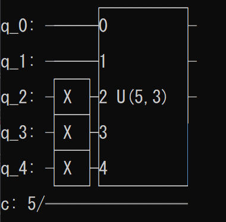
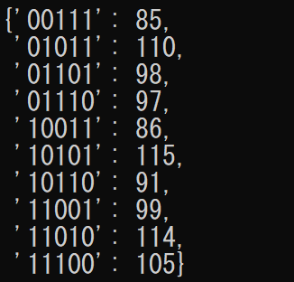
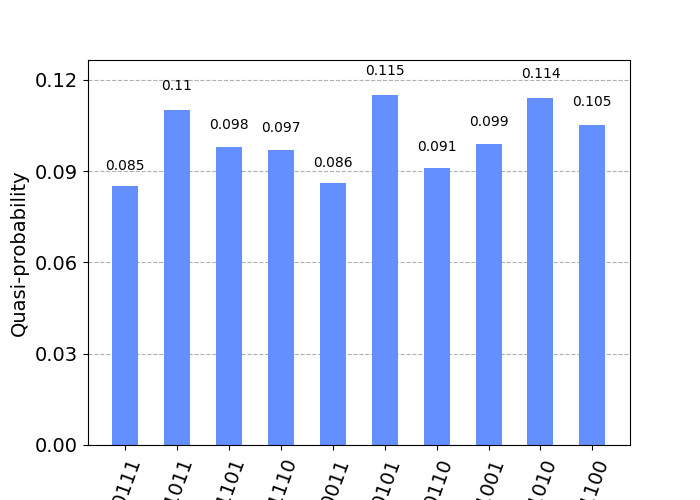

# Dicke State 的準備

產生多體量子糾纏態 Dicke State 的量子線路，參考論文 Deterministic Preparation of Dicke States 方法實作。

---

本專案目的是提供快速簡潔的方法來產生多體糾纏態Dicke State，使用者僅需呼叫函式即可獲得量子線路，並可對其進行測量、計數、後續的量子線路操作。

## Install

首先 clone 本專案到本地端
環境需要以下套件
```
matplotlib==3.8.2
qiskit==0.45.1
qiskit_aer==0.13.3
qiskit_ibmq_provider==0.19.2
qiskit_terra==0.45.1
```
使用conda install或pip install 進行安裝

## Usage


### 得到量子線路
```
from DickeState import DickeState

d = DickeState(n=5,k=3,token=None,backend=None)
d.get_qc()
```


### 測量
```
d.measure()
d.count(shots=1000)
```


### 測量圖表化
```
d.draw_bar()
```

